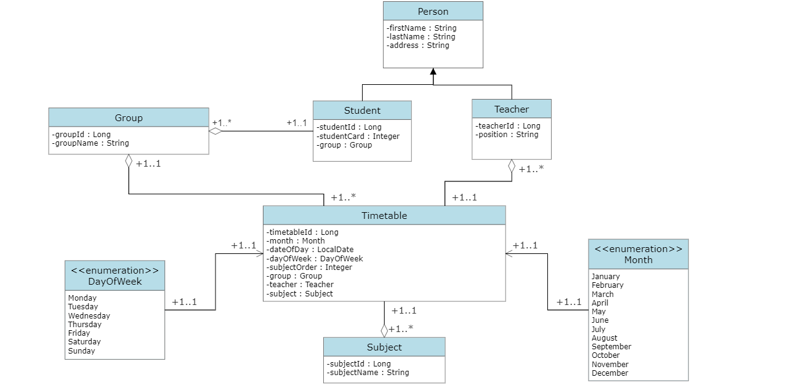

# University-CMS

## University Schedule web application

### UML diagram: 

## Development process 

### 1) Decompose university 
   At this stage, analysis and decomposition for the university were carried out. 
   The main entities for this project and the mapping strategies between them have been defined. 
   UML diagram was also created.

### 2) Bootstrap project
At this stage, A Spring Boot project with the required dependencies 
(Spring Web, Spring Data JPA, Thymeleaf, Flyway Migration, PostgreSQL Driver) was created. After that, A docker-compose 
file for the Postgres DB was created. Then an SQL migration script according to the UML was created.  Also, JPA repositories 
for each entity was created, which were defined before, and created a service for the Timetable entity where I made methods to get 
the schedule for a student for one day and month and the same for a teacher. 
A controller for Timetable with four endpoints for each method of Timetable service was created.
After that, I created an HTML home page(using Thymeleaf) and a page for getting schedules for teachers and students.

### 3) Create basic UI
At this stage, Bootstrap for the HTML pages was added.

### 4) Adding Security
At this stage, Spring Security was added. I added roles for users: ADMIN, STUDENT, and TEACHER.

#### Sequences of the task execution:
- A User entity was created.  A mapping strategy between the User, Student, and Teacher was added. 
- A Role entity was added with a mapping strategy between the User and the Role. 
- A realization for UserDetailsService was created, and added PasswordEncoder realization. 
- A user service was created in which methods were added to add a user as a student or teacher. methods were also created to get all users or a user by username.
- An authorization filter was added.
- A form login page was added where the user can authenticate by using his credentials or sign up as a Teacher or as a Student. 
- Profiles for Student, Teacher, and Admin were added.
- In the admin profile, the ability to list all users and change their roles was added. 
In the profile for students and teachers, you can get a schedule for a month and one day.

#### Try functionality:

###### Log In:
when: you click on the "Log in" button on the navigation bar.\
then: you will be redirected to the login page, where you can log in using your credentials.
###### Registration:
when: you click on the "Sign up" button for teacher or for student registration on the login page.\
then: you will be redirected to the registration page, where you can register by entering the required personal data.
###### Student and Teacher profile:
when: you click on the "My Profile" button on the navigation bar.\
then: you will be redirected to the profile page, where you can view your schedule for a month or a day.
###### Admin profile:
when: you have ADMIN role and click on the "My Profile" button on the navigation bar.\
then: you will be redirected to the admin page, where you can see all users and select a role for them.
###### Log out:
when: you click the "Log out" button on the navigation bar.\
then: you will be logout.

### 5) Implement Subjects view + edit feature
At this stage, the possibilities for creating, reading, updating, and deleting subjects were added.

#### Sequences of the task execution:
- A Subject service was created where methods for CRUD operations were added. 
- A Subject controller was created with the appropriate endpoints for reading, updating, creating, and deleting subjects.

#### Try functionality:

###### All Subjects:
when: you click on the "Subjects" button on the navigation bar\
then: you will be redirected to the page with all the subjects
###### Subject Manager:
when: you click on the "Manage Subjects" button in the admin profile\
then: you will be redirected to the subject manager page
###### Add Subject:
when: you enter the name of the subject, in the field above the table of all items, and click the "Add Subject" button\
then: the subject will be added
###### Delete Subject:
when: you click on the "Delete" button in the Subjects table for the selected subject\
then: subject will be deleted
###### Update Subject:
when: you change the name of a subject in the subjects table and click the "Update" button\
then: the subject's name will be changed

### 6) Implement Groups view + edit feature
At this stage, the possibilities for creating, reading, updating, and deleting groups were added.

#### Sequences of the task execution:
- A Group service was created where methods for CRUD operations were added.
- A Group controller was created with the appropriate endpoints for reading, updating, creating, and deleting groups.

#### Try functionality:

###### All Groups:
when: you click on the "Groups" button on the navigation bar\
then: you will be redirected to the page with all the groups
###### Group Manager:
when: you click on the "Manage Groups" button in the admin profile\
then: you will be redirected to the group manager page
###### Add Group:
when: you enter the name of the group, in the field above the table of all items, and click the "Add Group" button\
then: the group will be added
###### Delete Group:
when: you click on the "Delete" button in the groups table for the selected subject\
then: group will be deleted. The schedule for this group will also be deleted
###### Update Group:
when: you change the name of a group in the groups table and click the "Update" button\
then: the group's name will be changed

### 7) Implement Students view + edit feature
At this stage, the ability to assign and reassign students was added.

#### Sequences of the task execution:
- Methods for deleting and adding a student were added to the group service. 
- Endpoints were added to the group controller by adding and deleting students, and an endpoint was added to get all the students of the selected group.

#### Try functionality:

###### All Students:
when: you click on the "Students" button on the navigation bar\
then: you will be redirected to the page with all the students
###### Student Manager:
when: you click on the "Manage Groups" button in the admin profile and click the "Select students for a group" button\
then: you will be redirected to a page where all students from this group will be shown
###### Add Student for group:
when: you select a student from the list above the table add click the "Add Student" button\
then: the student will be added to the group
###### Delete Student from group:
when: you click on the "Delete" button in the students table for the selected student of the group\
then: the student will be deleted from the group

### 8) Implement Teachers view + edit features
At this stage, the ability for the teacher to see his subjects in his profile was added.

#### Sequences of the task execution:
- A method was added to the subject service to get the teacher's subjects. 
- A corresponding endpoint has was added to the teacher controller

#### Try functionality:

###### Get teacher's subjects:
when: you click on the "Get Subjects" button on the teacher profile page\
then: you will be redirected to the page with the teacher's subjects

### 9) Implement Schedule view + edit features
At this stage, functionality was added by creating, reading, updating, and deleting schedules.

#### Sequences of the task execution:
- The Calendar service was added in which a method was made for obtaining dates with a schedule for a month for a certain group. 
- CRUD operations were added to the Timetable service. 
- The corresponding endpoints were added to the Timetable controller

#### Try functionality

###### Timetable manager page
when: you click on the "Manage Subjects" button in the admin profile and select the group and the month for which the 
schedule will be made.\
then: you will be redirected to the timetable manager page. In this page you will see all days of month and timetables for these days
###### Add subject for the selected day
when: you select subject order, the subject, and the teacher for this subject, for the selected day, and click "Add Subject" button\
then: the subject for the selected day of month will be added
###### Delete subject from the selected day
when: you click on the "Delete" button of the selected subject\
then: the subject will be deleted from the schedule for the selected day
###### Update subject from the selected day
when: you change subject order, name or teacher and press the "Update" button\
then: this subject for the selected day of month will be updated

## User Capabilities
Unauthenticated user:
- User can log in
- User can register as teacher or student
- User can see all subjects

User is logged on as Admin:

- User can see all students, teachers, groups and subjects by clicking the corresponding button on the navigation bar
- User can go to the profile by clicking the 'My profile'
- User can list all registered users on user admin page
- User can set required role for each registered user
- User can create/read/update/delete subjects
- User can create/read/update/delete group information
- User can assign/ reassign Students to Group
- User can create/read/update/delete timetables for groups and teachers
- User can log out by clicking the 'Log out' button

User is logged on as Teacher:

- User can see all students, teachers, groups and subjects by clicking the corresponding button on the navigation bar 
- User can go to the profile by clicking the 'My profile'
- User can see own schedule according to selected date/range filter
- User can see all his courses
- User can log out by clicking the 'Log out' button

User is logged on as Student:

- User can see all students, teachers, groups and subjects by clicking the corresponding button on the navigation bar
- User can go to the profile by clicking the 'My profile'
- User can see own schedule according to selected date/range filter
- User can log out by clicking the 'Log out' button

## Technologies
Project is created with:

* Java 11
* Spring MVC
* Spring JPA
* Spring Security
* JUnit 5
* Mockito
* Testcontainers
* Postgres
* Flyway
* Docker
* Thymeleaf
* Lombok
